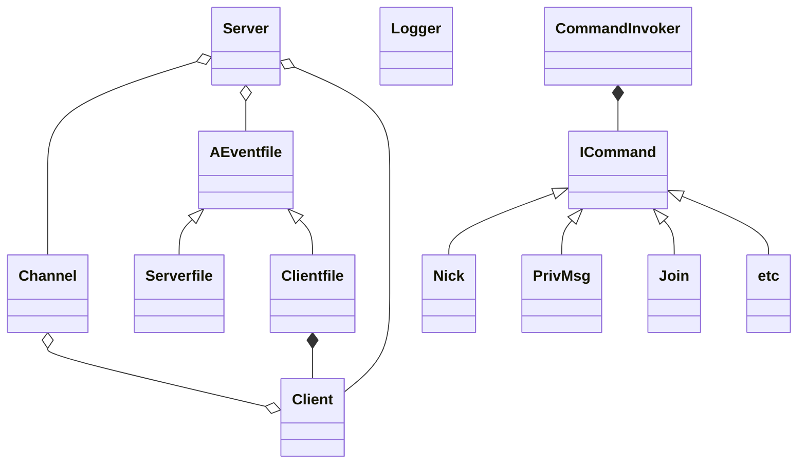
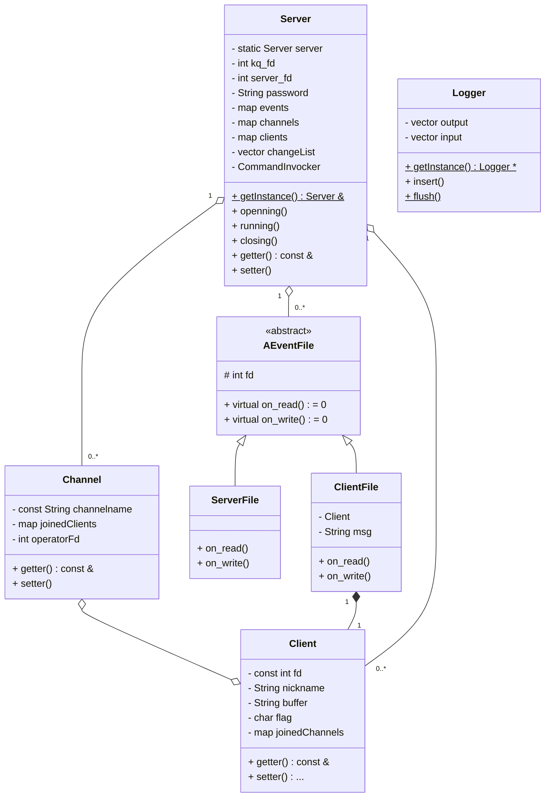

# ft_irc

### 간단 관계도

```mermaid
classDiagram

Server o-- Channel
Channel o--o Client

Server o-- AEventfile
AEventfile <|-- Serverfile
AEventfile <|-- Clientfile
Clientfile *-- Client
Server o-- Client

class Logger


CommandInvoker *-- ICommand
ICommand <|-- Nick
ICommand <|-- PrivMsg
ICommand <|-- Join
ICommand <|-- etc
```

### 서버 주요 관계도  

```mermaid
classDiagram

Server "1" o-- "0..*" Channel

ClientFile "1" *-- "1" Client 
Server "1" o-- "0..*" AEventFile
AEventFile <|-- ServerFile
AEventFile <|-- ClientFile

Server "1" o-- "0..*" Client

Channel o--o Client

class Client{
    - const int fd
    - String nickname
    - String buffer
    - char flag
    - map<String, Channel *> joinedChannels
    + getter() const &
    + setter()...
}

class Server{
    - static Server server
    - int kq_fd
    - int server_fd
    - String password
    - map<int, EventFile *> events
    - map<String, Channel *> channels
    - map<String, Client *> clients
    - vector<kevent> changeList

    - CommandInvocker

    + getInstance()$ Server &

    + openning()
    + running()
    + closing()

    + getter() const &
    + setter()
}

class Channel{
    - const String channelname
    - map<fd, Client *> joinedClients
    - int operatorFd
    + getter() const &
    + setter()
}

class Logger{
    - vector<String> output
    - vector<String> input
    + getInstance()$ Logger *
    + insert()
    + flush()$
}

class AEventFile{
    <<abstract>>
    # int fd
    + virtual on_read() = 0
    + virtual on_write() = 0
}
class ClientFile{
    - Client
    - String msg
    + on_read()
    + on_write()
}
class ServerFile{
    + on_read()
    + on_write()
}

```
