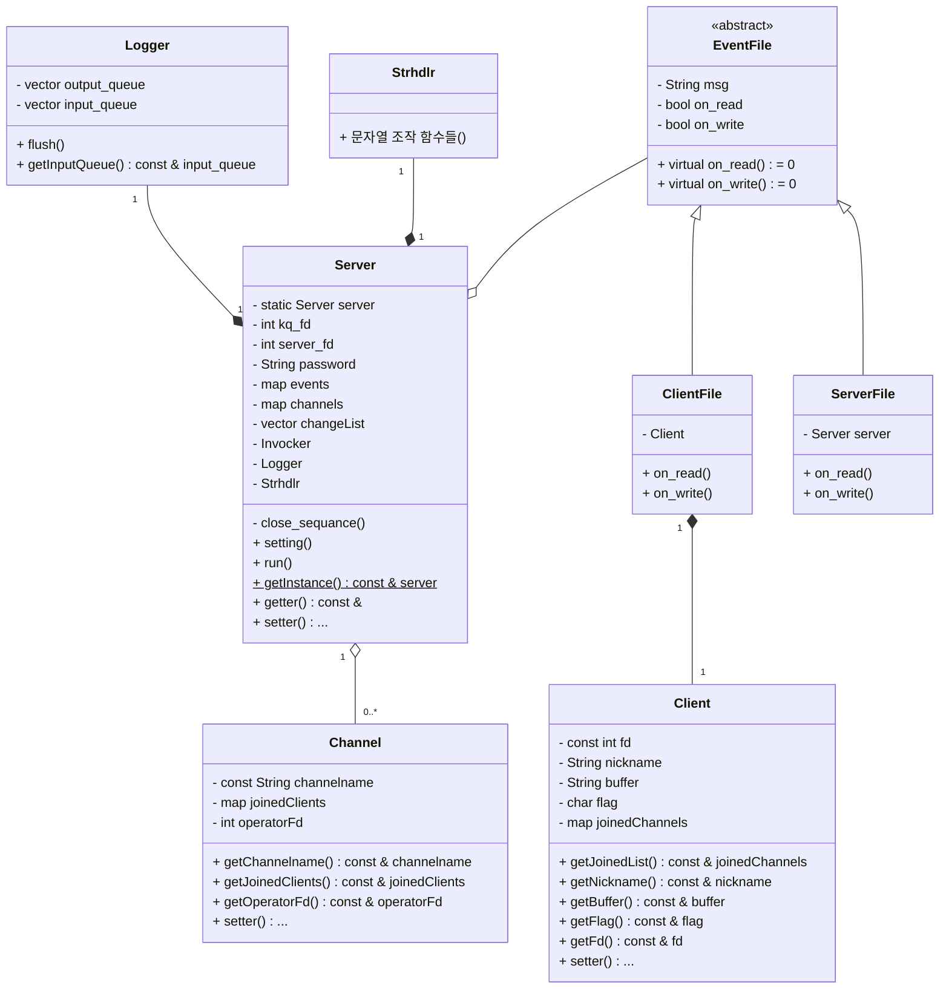

# ft_irc

```mermaid
classDiagram
Server "1" o-- "0..*" Channel
ClientFile "1" *-- "1" Client 

EventFile --o Server
EventFile <|-- ClientFile
EventFile <|-- ServerFile

Logger "1"--*"1" Server
Strhdlr "1"--*"1" Server

class Logger{
    - vector<String> output_queue
    - vector<String> input_queue
    + flush()
    + getInputQueue() const & input_queue
}
class Server{
    - static Server server
    - int kq_fd
    - int server_fd
    - String password
    - map<int, EventFile *> events
    - map<String, Channel *> channels
    - vector<kevent> changeList

    - Invocker
    - Logger
    - Strhdlr

    - close_sequance()
    + setting()
    + run()
    + getInstance()$ const & server
    + getter() const &
    + setter()...
}
class EventFile{
    <<abstract>>
    - String msg
    - bool on_read
    - bool on_write
    + virtual on_read() = 0
    + virtual on_write() = 0
}
class ClientFile{
    - Client
    + on_read()
    + on_write()
}
class ServerFile{
    - Server server
    + on_read()
    + on_write()
}
class Client{
    - const int fd
    - String nickname
    - String buffer
    - char flag
    - map<String, Channel *> joinedChannels
    + getJoinedList() const & joinedChannels
    + getNickname() const & nickname
    + getBuffer() const & buffer
    + getFlag() const & flag
    + getFd() const & fd
    + setter()...
}
class Channel{
    - const String channelname
    - map<fd, Client *> joinedClients
    - int operatorFd
    + getChannelname() const & channelname
    + getJoinedClients() const & joinedClients
    + getOperatorFd() const & operatorFd
    + setter()...

}

class Strhdlr{
+ 문자열 조작 함수들()
}
```
